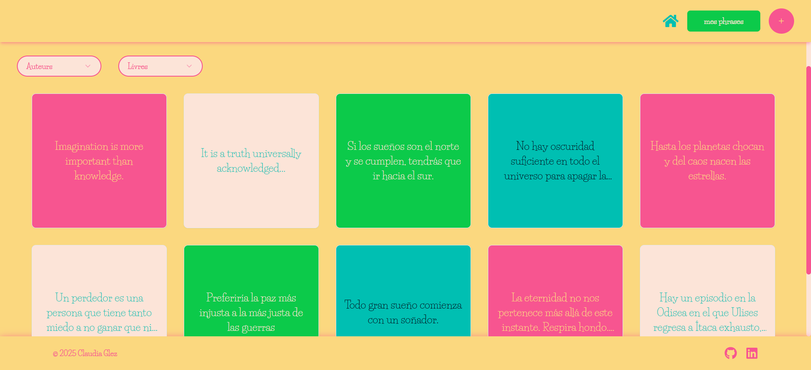

# :open_book: Mes Mots <br>

The ‘Mes Mots’ application allows users to save, organise and view quotes from books in an intuitive way. It is designed for literature lovers, students and writers who wish to keep a record of their favourite or relevant quotes.

## 🎯 Aim of the project

The main purpose of this application is to simplify the collection and management of literary quotations, offering a minimalist but efficient tool for users interested in keeping organised and personalised records of their favourite quotations.

## :star: Main Features 

📝 Quote management: Add, edit and delete literary quotes.
<br>
📂 Organisation by author and book: Quotes can be easily categorised according to the author and the work they belong to.
<br>
🔍 Search and filters: Tools to find quotations quickly.
<br>
📊 User-friendly interface: A simple and accessible user experience.


## :camera: Preview



## ⚙️ Technologies

### Frontend 

HTML, CSS, JavaScript, React, TailwindCSS, Shadcn
<br>

### Backend

PHP, Laravel
<br>

### Database

MongoDB
<br>


## :computer: Get Started:

### Backend 

* Clone this repository:
```
git clone https://github.com/claudiaglez/MesMots.git
```

* Navigate to the directory:
```
cd MesMots
```

* Go to the backend folder:
```
cd Back
```

* Install PHP dependencies
```
composer install
```

* Configure the environment file
```
cp .env.example .env
```
* Configure database
> [!WARNING]
> This is an example of the configuration of the database.
```
DB_CONNECTION=mongodb
DB_HOST=127.0.0.1
DB_PORT=27017
DB_DATABASE=database-name
DB_USERNAME=your-username
DB_PASSWORD=your-password
```

* Generates the Laravel application key
```
php artisan key:generate
```

* Running the development server
```
php artisan serve
```

### Frontend

* Navigate to the frontend folder:
```
cd Front
```

* Install dependencies
```
npm install
```

* Running the development server
```
npm run dev
```

* Open your browser and visit
```
http://localhost:5173/
```

* Enjoy! :sun_with_face:

## :test_tube: Testing

This project includes automated tests to ensure the quality and stability of the code.

### Tools Used
- **Backend (Laravel)**: PHPUnit
- **Frontend (React)**: Jest, React Testing Library

### Running Tests

#### Backend (Laravel)
To run the tests in the backend:

```
php artisan test
```

#### Frontend (React)
To run the tests in the frontend:

```
npm test
```

#### Test Environment Setup
Copy the .env.example file to .env and adjust the necessary configurations.
Make sure the backend services are running properly before executing the frontend tests.

#### Test Coverage
To check the test coverage in the backend, run:

```
php artisan test --coverage
```

In the frontend:

```
npm test -- --coverage
```


## 📄 API Documentation

<details>
  <summary>Endpoints (Click to expand)</summary>

### Available Endpoints:

| Method | Endpoint           | Description                  |
|--------|--------------------|------------------------------|
| GET    | `/api/quotes`      | Retrieve all quotes          |
| POST   | `/api/quotes`      | Add a new quote              |
| PUT    | `/api/quotes/{id}` | Update a quote by ID         |
| DELETE | `/api/quotes/{id}` | Delete a quote by ID         |

#### Example Response (Success):
```json
{
  "id": "12345",
  "quote": "To be, or not to be.",
  "author": "William Shakespeare",
  "book": "Hamlet"
}

```

#### Example Response (Error):
```json
{
  "error": "Quote not found"
}

```


</details> 

## 📂 Project Structure

```bash
MesMots/
├── Back/                           # Backend - Laravel
│   ├── app/                        # Main application
│   │   ├── Controllers/            # API Controllers
│   │   ├── Models/                 # Data Models
│   │   └── ...
│   ├── config/                     # Project Configuration
│   ├── routes/                     # Route Definitions
│   ├── .env.example                # Environment configuration
│   ├── composer.json               # PHP Dependencies
│   ├── public/                     # Public Files
│   └── tests/                      # Unit and Feature Tests
│       ├── Unit/                   # Unit Tests
│       └── Feature/                # Feature Tests
│
├── Front/                          # Frontend - React
│   ├── src/                        # Source Code
│   │   ├── assets/                 # Images and static resources
│   │   ├── components/             # Reusable Components
│   │   ├── pages/                  # Main app Pages
│   │   ├── App.jsx                 # React Root Component
│   │   └── index.jsx               # Entry Point
│   ├── public/                     # Public files (HTML, etc.)
│   ├── package.json                # Node.js dependencies
│   ├── vite.config.js              # Vite Configuration
│   └── tests/                      # Unit and Component Tests (Frontend)
│
└── README.md                       # Project Documentation

```


## :open_hands: Contributions

Do you have any suggestion? Please, feel free to contact me or open an issue or pull request :star_struck:


 ## 👩‍💻 Author

🧡 [Claudia González](https://www.linkedin.com/in/claudiaglezgarcia/)<br>
